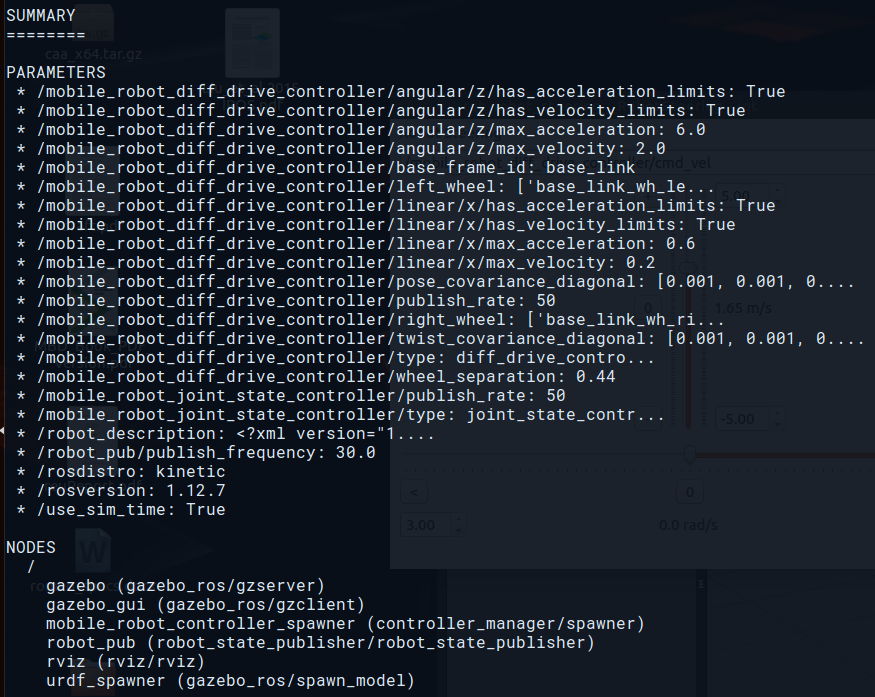
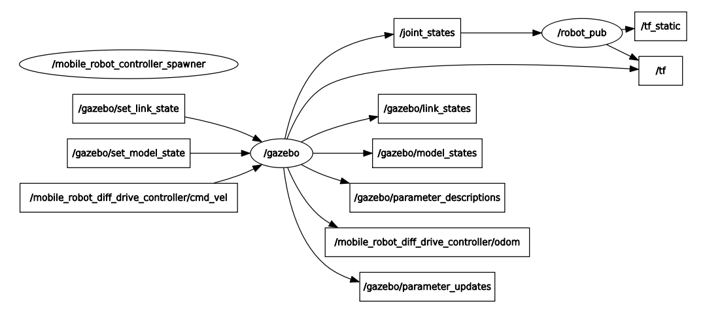
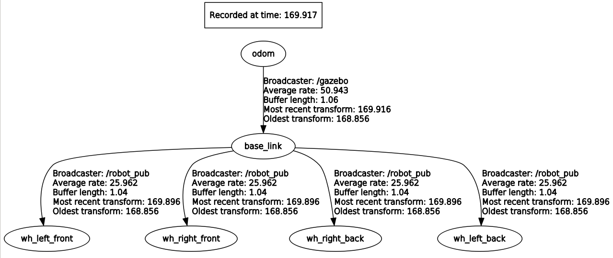

# ros-mobile-robot
A tutorial on building simulated mobile robot in ROS

# Workflow
For developing a mobile-robot(we are focusing on wheeled robot), the stepwise workflow we are following is as follows

## Section 1
- [x] [Part 1 : Create basic packages](doc/create_ros_package.md)
- [x] [Part 2 : Creating URDF](doc/creating_urdf.md)
- [x] [Part 3 : Converting URDF for Gazebo](doc/converting_urdf.md)
- [x] [Part 4 : Simulating in Gazebo](doc/simulating.md)
- [x] [Part 5 : Making the Robot generic](doc/generic.md)

## Section 2
- [x] [Part 1 : Adding a STL file for sensor](doc/adding_stl.md)
- [x] [Part 2 : Adding sensor plugin in Gazebo](doc/adding_sensor.md)

## Setup
- Ubuntu installed in laptop / PC (Normally the latest stable one, at the time of writing this article, *Ubuntu 16.04*)
- Appropriate ROS distro for the Ubuntu(also the latest stable one, at this time, *ROS Kinetic Kame*)
- Around 4-8 GB RAM for running the simulation.

## Few screenshots

